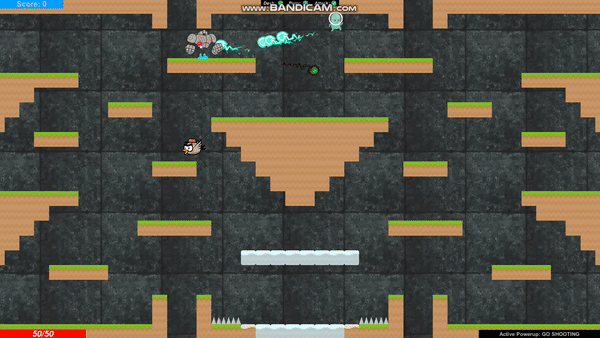

# SmashClub
Unity based action/survival platfomer. Made by me and team of 4 people for AI for games class. Initially code was on Unity Asset Server but account was lost so I pushed my local copy of source here.

The goal is to select one of three characters and kill as many waves of ennemies as possible. 

I wrote code responsible for map generation, navigation mesh and pathfinding.

